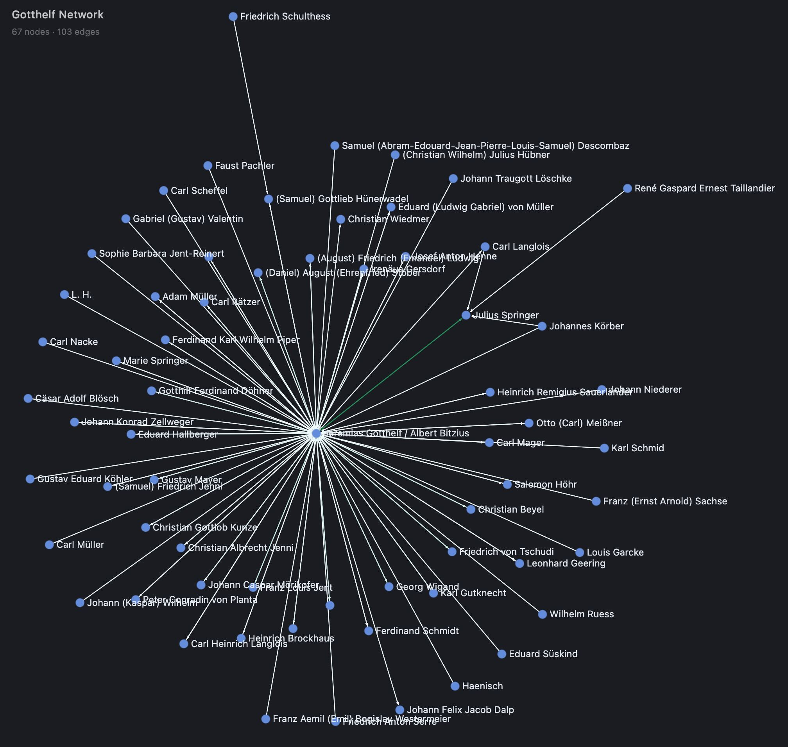

# Gotthelf Network — Interactive Graph Visualization

**Live → https://rafapolo.github.io/daschViz/**



A fullscreen interactive visualization of the correspondence network from **daschViz**, a Digital Humanities project exploring the epistolary network of [Jeremias Gotthelf](https://en.wikipedia.org/wiki/Jeremias_Gotthelf) (Albert Bitzius, 1797–1854), the Swiss author and pastor.

## About the Network

The GEXF data (`gotthelf_network.gexf`) was exported from **Gephi 0.10.1** and encodes a directed letter-exchange graph:

| Property | Value |
|---|---|
| Nodes (correspondents) | 67 |
| Edges (letters) | 103 |
| Graph type | Directed, weighted |
| Communities | 3 (Modularity Class 0, 1, 2) |

Node colours reflect community membership. Node size scales with degree centrality. Click any node to highlight its direct connections; click again or on the background to clear.

## Setup

```bash
bun install
bun run dev
```

The GEXF is loaded directly — no preprocessing needed.

## Stack

- [Sigma.js](https://www.sigmajs.org/) — WebGL graph renderer
- [Graphology](https://graphology.github.io/) — graph data structure + GEXF parser
- [ForceAtlas2](https://graphology.github.io/standard-library/layout-forceatlas2) — force layout
- [Vite](https://vite.dev/) + TypeScript + Bun

## Data context

Prepared as part of a [DaSCH](https://www.dasch.swiss/) (Swiss National Data and Service Center for the Humanities) project. Nodes represent individuals who exchanged letters with Gotthelf or within his circle; edge weights reflect letter counts. The three detected communities likely correspond to distinct social or geographic clusters — clergy colleagues, literary contacts, and administrative/political correspondents.
